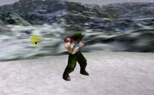
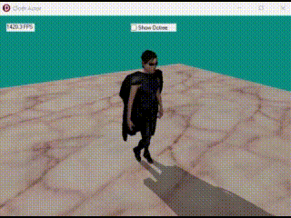
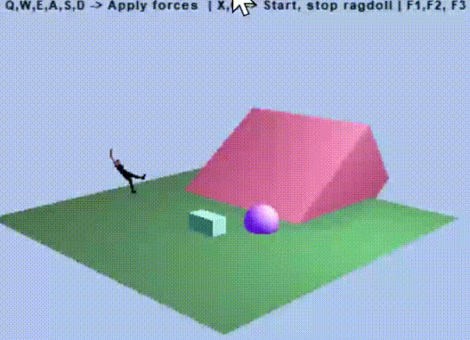

# GLXEngine
GLXEngine - a graphics engine collector with GLScene/GXScene/LZScene component packages for Delphi & C++ programming.
Class libraries for creating 3D scenes with rendering and animations of spatial objects 
include managers for supporting physics, sounds, terrains with materials and shaders. 
### How to install
1. Download a zip archive of the last release or clone the repository
2. Run _setupDLL_admin.cmd to support external DLLs libraries
3. Configure the IDE settings and paths to src, sources and sourcex, include and lib dirs  
4. Open the GLSEngine.groupproj in RAD Studio Delphi or .lpk projects for Lazarus, compile and install components
5. Users of the C++ Builder Personality only need to copy the compiled .bpl packages from ../GLXEngine/bpl directory 
   to a folder  C:\Users\Public\Documents\Embarcadero\Studio\23.0\Bpl then add them and install to palette  
5. Run Examples for Delphi or C++Builder  
### Some examples: 
GLSViewer
 

 
ActorToPoint
 

 
ClothActor 
 

 
Ragdoll 
 

 
Christmas
 

 
Forest
 

 
Village
 

 
Plot2D
 

 

[Admin](https://t.me/glscene)
